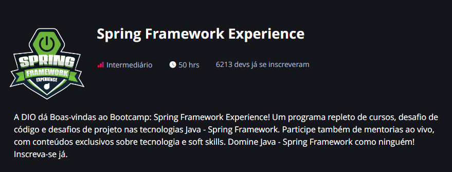

<h1 align="center">
Bootcamp Spring Framework Experience
</h1>

Resumos das aulas do Módulo 3 do Bootcamp sobre Spring Framework - <a href="https://web.dio.me/track/spring-framework-experience">DIO</a>)

#### Conteúdos abordados:   
- Programação Orientada a Objetos (POO)
- Apache Maven
- Banco de Dados (MySQL)
- Spring Boot
- JDBC e JPA
- API REST
- Spring Security

##### Demais conteúdos já foram abordados no <a href="https://github.com/ingrarib/santander-code-girls">Bootcamp Santander Code Girls</a>

<h2>Certificado</h2>

Em andamento...
